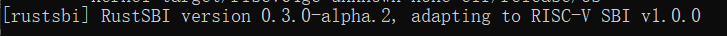
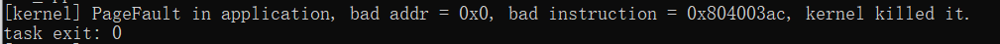
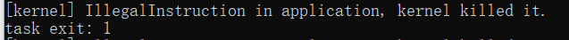
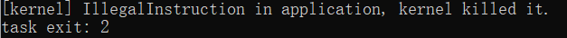

# 第 1 题
## rustsbi版本

## ch2b_bad_address 
页错误并退出

## ch2b_bad_instructions
报错非法指令并退出

## ch2b_bad_register
报错非法指令并退出

# 第 2 题
## 2.1
a0：内核栈

使用场景：
1. 初始化 TASKMANAGER 时会通过 TaskContext 的 goto_restore 函数进入 __restore
2. 当 trap_handler 返回之后，使用 __restore 从保存在内核栈上的 Trap 上下文恢复寄存器。

## 2.2
恢复`sstatus`、`sepc`、`sscratch` 3个寄存器的状态

sstatus：保存 Trap 发生之前 CPU 处在哪个特权级（S/U）等信息

sepc：Trap 处理完成后默认会执行的下一条指令的地址。

sscratch：此时指向用户栈

## 2.3
x2 就是 sp，保存在 TaskContext 里了
x4 是 tp，应用程序暂时不会用到
## 2.4
L60 交换了 sscratch 和 sp 里的值，交换之后恢复成 **`sp`指向用户栈，`sscratch`指向内核栈** 的状态
## 2.5
sret：将当前的特权级按照 sstatus 的 SPP 字段设置为 U 或者 S ，跳转到 sepc 寄存器指向的那条指令，然后继续执行。
## 2.6
L13 交换了 sscratch 和 sp 里的值，交换之后暂时是 **`sp`指向内核栈，`sscratch`指向用户栈** 的状态
## 2.7
`ecall`指令会从U进入S态